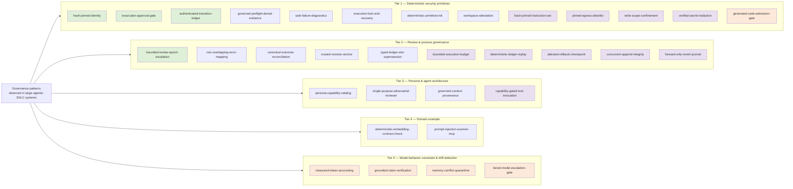

# Decomposition plan: individual agentic-governance demo apps

## Principle

**Bias toward individual features, not orchestration.** Large agentic
governance systems tend to grow a full multi-agent orchestrator (workflow
runner, multi-agent pipeline, integrated UI). Reproducing that here first
would just be a smaller copy of the same hard-to-learn-from system. Instead,
every app in this catalog demonstrates **one** governance primitive,
standalone, with a fake/toy payload instead of a real story, embedding, or
workflow.

Every app states, in the style of an atomic-instruction grading rubric's
criterion record:

- **Atomic claim** — the one sentence a skeptic could test.
- **Inspired by** — the real-world pattern this app models (named for
  context; this repo does not depend on or import from that source).
- **Enforcement class** — deterministic (binary pass/fail), hybrid
  (deterministic envelope + generated content), or informational (pattern
  worth knowing, no gate).

An app whose claim can't fit in one sentence is scoped wrong and should be
split further.

## Explicitly out of scope (for now)

These are real, valuable governance patterns, but they are orchestration,
not primitives — building them here first would recreate the "hard to learn
from" problem this repo exists to solve:

- End-to-end multi-agent workflow orchestration as a whole system.
- An integrated persona → capability → process-lifecycle pipeline.
- A localhost control-panel UI that ties every primitive together.
- A full create → review → remediate loop as one system (its *pieces* —
  bounded review escalation, non-overlapping error mapping — are in scope
  individually; the loop itself is not, yet).

If, after building the individual apps below, composing two or three of them
into a minimal pipeline turns out to be the best teaching tool, that's a
deliberate later decision — not the default.

**A clarification added in v1.4.** This list rules out orchestration, not every
risk that involves more than one agent. A message *bus* is orchestration; a
signed, addressed, sequenced *envelope* is a primitive. A *scheduler* is
orchestration; a *circuit breaker* around one dependency is a primitive. The
catalog spent three revisions treating "multi-agent risk" and "multi-agent
orchestration" as the same category, and left three published risks uncovered
for a reason that did not apply to them. The rule did not change; the reading
of it was wrong.

## App catalog

### Tier 1 — Deterministic security primitives
*Inspired by: hash-pinned executable identity, exact-hash approval gates,
tamper-evident ledgers, and safe failure/recovery handling in governed agent
launchers.*

| App | Atomic claim | Enforcement | Inspired by |
|---|---|---|---|
| `hash-pinned-identity` | A launcher refuses to run any executable whose resolved absolute path *and* SHA-256 don't both match a policy pinned outside the workspace — even if the name on `PATH` is identical. | deterministic | hash-pinned execution identity policies |
| `exact-plan-approval-gate` | A destructive action can only be approved by echoing back the *exact* SHA-256 of the plan that was shown — a "yes" with no hash is rejected. | deterministic | prepare/approve/execute governed-evaluation contracts |
| `authenticated-transition-ledger` | An append-only, SHA-256-chained, HMAC-signed event log detects a single edited byte anywhere in its history, not just at the tampered row. | deterministic | authenticated transition ledgers |
| `governed-preflight-denial-evidence` | When a precondition fails, the system emits a fixed-shape, allowlisted-field denial record — never raw stderr, paths, or secrets. | deterministic | governed preflight denial audits |
| `safe-failure-diagnostics` | A child-process failure is classified into one of a fixed vocabulary of categories from at most 8,192 observed bytes, and only the category — never the bytes — is ever persisted. | deterministic | sanitized failure diagnostic capture |
| `execution-lock-and-recovery` | A crashed run leaves a lock that only an explicit, challenge-authenticated operator attestation can clear — the system never infers liveness on its own. | deterministic | reservation-recovery endpoints |
| `deterministic-primitives-kit` | The same input byte-for-byte always produces the same canonical JSON, the same hash, and the same safe-ID validation — across restarts, across machines. | deterministic | canonical-JSON / safe-ID / atomic-write primitives |
| `workspace-attestation` | A governed run's *claimed* file changes are diffed against a real git-worktree snapshot taken immediately before and after — a claim that doesn't match the diff fails closed. | deterministic | workspace attestation around agent-driven test runs |

**v1.1 — gap closure.** The apps below were not observed in any source system.
They were derived from this catalog's own criteria: each closes a gap that the
v1 catalog leaves open while still reducing to one atomic claim, and none of
them is on the out-of-scope list above.

| App | Atomic claim | Enforcement | Fills the gap left by |
|---|---|---|---|
| `hash-pinned-instruction-set` | A run executes only under the exact instruction set it pinned — a single edited byte, an added file, a removed file, or two files swapping contents all fail closed before the run starts. | deterministic | `deterministic-embedding-contract-check` pins a model *request*; nothing pinned the *instructions*. |
| `pinned-egress-allowlist` | An outbound request is allowed only if its scheme, host, and port all match an allowlist entry exactly — and every hop of a redirect chain is checked, not just the first. | deterministic | `hash-pinned-identity` pins what binary runs; nothing pinned where it may talk. |
| `write-scope-confinement` | A write is denied before any bytes touch disk unless its fully resolved path lies inside the declared scope root — traversal, absolute paths, prefix siblings, and symlink escapes all fail closed. | deterministic | `workspace-attestation` detects a bad claim after the run; nothing prevented the write. |
| `verified-secret-redaction` | No registered secret can appear in an emitted artifact — the emitter redacts, then re-reads its own serialized output and refuses to emit if any secret survived. | deterministic | `safe-failure-diagnostics` and `governed-preflight-denial-evidence` protect the failure path; nothing covered successful output. |
| `generated-code-admission-gate` | Model-generated code is admitted only if every import, call, and attribute access in its parsed AST is permitted — a denied program is never compiled and never runs. | deterministic | The catalog pinned what binary runs and where it writes, but nothing inspected code the model itself produced. Closes the ASI05 primitive gap. |
| `managed-block-confinement` | A managed write replaces only the content between the exact markers — everything outside them survives byte for byte, and generated content carrying a marker of its own is refused. | deterministic | Nothing governed an agent writing into a document humans also edit. |
| `staged-input-allowlist` | Only files matching the declared policy enter the agent's view, every excluded file is recorded with a reason, and exceeding a cap stages nothing at all. | deterministic | `write-scope-confinement` governs where an agent may write; nothing governed what it may ever see. |
| `unproven-isolation-fails-closed` | A run proceeds only when isolation is verified by a probe that actually ran — an operator assertion and a capability declaration are recorded and counted for nothing. | deterministic | The catalog trusted its own declarations; nothing separated a claim about the world from a measurement of it. |
| `argv-not-shell-invocation` | A child process is launched from an absolute program path and a list of argument values, so a shell metacharacter inside an argument arrives as literal text. | deterministic | `hash-pinned-identity` pins which file runs; nothing pinned the shape of the launch. |
| `reduced-child-environment` | A child process receives only the variables a declared policy passes through — everything else, including variables nobody anticipated, is absent rather than redacted. | deterministic | Nothing treated the process environment as an attack surface. |

### Tier 2 — Review & process governance
*Inspired by: bounded human-escalation loops and deterministic,
non-overlapping validation/reconciliation contracts seen in governed
story-review pipelines.*

| App | Atomic claim | Enforcement | Inspired by |
|---|---|---|---|
| `bounded-review-epoch-escalation` | After 3 review rounds with open findings, the loop stops and requires a *new*, hash-bound human reauthorization naming the exact terminal evidence — it cannot self-extend. | deterministic | hard-capped review-epoch escalation policies |
| `non-overlapping-error-mapping` | Every test fixture reaches exactly one named validation stage and exactly one named error — never two, never zero. | deterministic | non-overlapping validation-stage error mapping |
| `canonical-outcome-reconciliation` | Every input key in a batch receives exactly one attributable success or failure outcome, in a fixed order — nothing silently dropped, nothing double-counted. | deterministic | ordered asset-reconciliation outcome contracts |
| `trusted-revision-anchor` | The "current" commit is selected only from a ledger slot position, never from caller-supplied input; "fresh" means "at the ledger head," not "recent by clock time." | deterministic | trusted revision/freshness contracts |
| `typed-ledger-slot-supersession` | A later record can only replace an earlier one by naming that exact slot key *and* the exact digest of the record it's replacing — a fork or missing predecessor fails closed. | deterministic | typed ledger-slot approval/retention authority |

**v1.1 — gap closure.** The apps below were not observed in any source system.
They were derived from this catalog's own criteria: each closes a gap that the
v1 catalog leaves open while still reducing to one atomic claim, and none of
them is on the out-of-scope list above.

| App | Atomic claim | Enforcement | Fills the gap left by |
|---|---|---|---|
| `bounded-execution-budget` | A run halts at the first action that would exceed a declared budget — the over-budget action never executes, nothing is partially charged, and the budget cannot be extended from inside the run. | deterministic | `bounded-review-epoch-escalation` caps one loop; nothing capped tool calls, cost, or time. |
| `deterministic-ledger-replay` | Replaying a ledger from genesis reproduces its state byte-for-byte, and any state the replay cannot reproduce is rejected — with the first divergent event named. | deterministic | `authenticated-transition-ledger` proves the log is intact; nothing proved the state was derivable from it. |
| `attested-rollback-checkpoint` | A rollback restores exactly a previously attested state digest, failing closed on an unattested target or a checkpoint whose bytes no longer hash to it. | deterministic | Nothing could return a run to a known-good state under the same evidence discipline. |
| `forward-only-revert-journal` | A revert is recorded as a new forward record naming the state it left behind, so the abandoned state stays readable and a rewritten history is detected. | deterministic | Split from `attested-rollback-checkpoint`: restoring an attested state and never erasing history are two rules. |
| `optional-input-does-not-block` | A run starts when every required input is present, even if every optional one is missing — a missing optional input is recorded and the run marked degraded, never escalated into a stop. | deterministic | Every other app teaches fail-closed; nothing taught what not to block on, and a catalog of refusals builds agents that cannot start. |
| `producer-approver-separation` | Whoever produced an artifact cannot approve it, and an approval is bound to the exact digest it covers — a rename, a delegate, or a later edit all fail closed. | deterministic | `exact-plan-approval-gate` binds an approval to a plan; nothing checked who was giving it. |
| `provable-dry-run` | A dry run performs no effect and still produces the complete plan, and that plan is the same plan the live run produces. | deterministic | Nothing demonstrated that a preview is a preview of the real thing. |
| `canonical-output-shape` | Generated output is accepted only if its headings are canonical, in the declared order, with no wrapper fence, no empty section, and within the word bound — and the checker never repairs what it rejects. | deterministic | `single-purpose-adversarial-reviewer` checks a payload schema; nothing checked the shape of prose an agent produces. |
| `validated-artifact-reuse` | An existing artifact is reused only when it is still valid for the inputs at hand, and every decision records which way it went and why. | deterministic | Nothing addressed reuse, where the dangerous failure is a fast confident answer from inputs that have since changed. |
| `failure-bulkhead` | After a declared number of consecutive failures the breaker opens and every subsequent call fails fast without invoking the dependency; it closes only when an explicit probe actually succeeds. | deterministic | Nothing stopped an agent hammering a dependency that was already down, which is what carries one failure outward. |
| `concurrent-append-integrity` | Under concurrent writers an append-only ledger admits exactly one entry per accepted append, with contiguous indices and an unbroken chain — a writer whose predecessor moved is rejected. | deterministic | `execution-lock-and-recovery` covers a crashed run's lock; nothing covered two live writers. |

`attested-rollback-checkpoint` originally carried both of those rules in one
app, and its claim needed an "and" to state them — the tell this catalog uses
for a mis-scoped app. It was split: restoring only an attested digest and never
erasing history are separable rules, and each now has its own claim, its own
module, and its own tests.

### Tier 3 — Persona & agent architecture
*Inspired by: declarative persona/capability catalogs and provenance-tagged
context assembly for governed agents.*

| App | Atomic claim | Enforcement | Inspired by |
|---|---|---|---|
| `persona-capability-catalog` | "Who is allowed to do what" (a YAML+JSON-Schema catalog) is fully separate from "what's running right now" (a runtime process list) — you can audit the first without touching the second. | informational | declarative persona/agent catalogs |
| `single-purpose-adversarial-reviewer` | One adversarial-review agent, schema-in/findings-out, callable with zero pipeline, zero orchestrator, and no state carried between calls. | hybrid | single-purpose adversarial-review agents |
| `governed-context-provenance` | Every piece of context handed to a model carries its source and an explicit `injection_disposition` ("clear" vs. untrusted) *before* assembly — the model never has to guess what it can trust. | deterministic | provenance-tagged, request-scoped context assembly |

**v1.1 — gap closure.** The apps below were not observed in any source system.
They were derived from this catalog's own criteria: each closes a gap that the
v1 catalog leaves open while still reducing to one atomic claim, and none of
them is on the out-of-scope list above.

| App | Atomic claim | Enforcement | Fills the gap left by |
|---|---|---|---|
| `capability-gated-tool-invocation` | A tool call runs only if the calling persona's declared capability set contains that tool's exact required capability — and a denied call never enters the tool function at all. | deterministic | `persona-capability-catalog` declares who may do what but denies nothing; Tier 3 had the declaration half without the enforcement half. |
| `authenticated-agent-message` | A message between agents is accepted only if it is signed by a known sender, addressed to that recipient, and carries a sequence strictly greater than the last accepted from that sender. | deterministic | ASI07 had no app because "multi-agent" was read as "orchestration". An envelope is not a bus. |
| `delegation-scope-attenuation` | Authority can only shrink as it is delegated — each link may hold a subset of what the link before it held, never a capability its delegator did not have. | deterministic | Nothing stopped a sub-agent asking for more than its delegator could have asked for. |

### Tier 4 — Domain example
*Inspired by: deterministic verification of a vendor API's exact request
contract, and single-purpose MCP servers.*

| App | Atomic claim | Enforcement | Inspired by |
|---|---|---|---|
| `deterministic-embedding-contract-check` | An embedding call's provider, model ID, version, and dimensions can be verified byte-for-byte against a captured request — with no live AWS call. | deterministic | deterministic embedding-request contract verification |
| `prompt-injection-scanner-mcp` | A single-purpose MCP server that does exactly one thing (flag likely prompt injection in a text blob) and nothing else. | hybrid | single-purpose prompt-injection-scanning MCP servers |

### Tier 5 — Model-behavior constraint & drift detection
*The deterministic gates a nondeterministic model is wrapped in, so its output
becomes predictable. Not security controls: reliability controls. Added in
v1.2.*

| App | Atomic claim | Enforcement | Fills the gap left by |
|---|---|---|---|
| `measured-token-accounting` | An unmeasured model call is refused rather than counted as zero, and the recorded per-call parts must reconcile exactly with the provider's reported total. | deterministic | `bounded-execution-budget` enforces a cap; nothing established that the number being capped was real. |
| `grounded-claim-verification` | Every factual claim must name a ground-truth key that exists and quote its value exactly — uncited, invented-source, and altered-quote all fail closed. | deterministic | Nothing checked whether generated content stayed anchored to what the system actually holds. |
| `memory-conflict-quarantine` | Two memory records asserting different values for one key are both retained and surfaced — the newer never silently overwrites the older. | deterministic | `governed-context-provenance` tags context going in; nothing governed contradiction in what is remembered. |
| `tiered-model-escalation-gate` | A cheap tier's output is used only if it passes the declared deterministic check; otherwise it escalates, and the ledger records which tier answered. | hybrid | Nothing made "we asked the cheap model first" unable to become a reason output reaches a caller unchecked. |
| `declared-objective-conformance` | Every action must cite an objective declared for the run, and the declared set cannot be widened from inside the run. | deterministic | Nothing made goal drift checkable: an agent goes off-mission one reasonable-looking action at a time. |

**Deliberately not in this tier:** *instruction-adherence* drift — whether a
model still follows the instructions it was given. That is the Instruction
Adherence Bench's question, and this repo is not IAB (see below).
`hash-pinned-instruction-set` covers the half that is deterministic — did the
instruction text change — and the other half genuinely needs a bench with a
corpus and a scorer, not a primitive.

18 apps is the target size for v1 — enough to cover every tier without
padding. Anything that doesn't reduce to one atomic claim gets split or cut.

v1.1 adds 10 gap-closure apps and v1.2 adds Tier 5's 4 plus
`generated-code-admission-gate`, for 33. v1.3 adds 10 more, for 43. v1.4 adds
the last 4, for 47 in total — every risk in the OWASP Top 10 for Agentic
Applications 2026 now has at least one app demonstrating a control for it.

The v1.3 set was derived differently from the others: by reading an atomic
instruction and test matrix for one real governed agent — 192 criteria bound to
source lines — and asking which of its themes had no teaching app here. Most
did. These ten did not. They were not found by looking
at another system; they were found by asking what this catalog leaves open.
The test each had to pass to be built: it reduces to one atomic claim, it is
standalone, it is enforceable deterministically, and it is not on the
out-of-scope list. Patterns that failed that test — a message bus, a router, a
lifecycle state machine — stayed out, because they are orchestration however
small you make them.

### Tier 2 — v1.5, instruction adherence

*Whether an agent followed the instructions that define what it does. The part
that is mechanically checkable is gated; the part that is not is reported as
unchecked rather than quietly assumed.*

| App | Atomic claim | Enforcement |
|---|---|---|
| `instruction-policy-gate` | Every declared instruction receives an explicit verdict; one with no mechanical checker is reported unenforceable, never counted as satisfied. | deterministic |
| `absent-evidence-is-not-compliance` | A criterion whose checker exists but produced no evidence this run is recorded as not observed, never as passed. | deterministic |
| `permissive-contract-is-a-gap` | A contract that admits a value the instruction forbids is a gap, recorded even when no artifact has ever sent one. | deterministic |
| `falsifiable-instruction-check` | An instruction registers only if its own checker rejects the violating fixture it ships. | deterministic |
| `deterministic-checker-contract` | A checker must return the same verdict for the same artifact on repeated evaluation. | deterministic |
| `traceable-instruction-source` | An instruction is bound to exact text at an exact location; if the source no longer holds it, resolving is refused. | deterministic |
| `ablation-required-for-causal-claim` | A finding is recorded as caused by an instruction only with a leave-one-out comparison; otherwise as correlation. | deterministic |
| `repeat-reliability-predeclared` | The attempt count is declared before the first run, every attempt retained, and an early conclusion refused. | deterministic |
| `enforcement-mechanism-attribution` | A result that does not name the enforcing mechanism cannot be compared with one that does. | deterministic |
| `composition-root-construction` | A declared collaborator may be constructed only in the composition root. | deterministic |
| `telemetry-is-not-cost` | A token count becomes money only against a pinned rate card for that exact model and version. | deterministic |
| `structural-duplicate-detection` | Two functions with the same implementation shape fingerprint identically regardless of their names. | deterministic |

These twelve came from sections 9 to 11 of the source matrix, which name five
test layers per criterion — unit, followed, needed, mechanism, repeat — and a
status vocabulary richer than pass and fail. They were built as twelve apps
rather than two so that each property can be observed on its own, which is the
same reason the rest of the catalog is shaped this way.

Two of them draw their own boundary in the README rather than overclaiming.
`structural-duplicate-detection` catches the same implementation under a
different name and not a different implementation of the same idea, because
that needs a similarity threshold and a picked number is not deterministic.
`composition-root-construction` checks a declared list of collaborator types,
because a checker that guessed which calls look like collaborators would flag
every `Decimal` and be switched off.

## Overlap review (v1.4)

The one-sentence rule cuts in only one direction. It catches an app that should
be **split**, because the tell is an "and" joining two rules. Nothing in this
plan catches an app that should be **merged**, and after 47 apps that is worth
checking rather than assuming.

Reviewed: the three pairs with the highest lexical overlap between their claims,
the four pairs a reader would most plausibly call redundant, and the two dense
clusters. **No merges.** The distinctions, recorded so the question does not
have to be re-opened from scratch:

| Pair | Why both exist |
|---|---|
| `bounded-execution-budget` / `declared-objective-conformance` | The highest lexical overlap in the catalog, because they share an idiom: a declared bound, an action refused, nothing executed. What is declared differs — a quantity versus a purpose. The shared shape is consistency, not duplication. |
| `capability-gated-tool-invocation` / `delegation-scope-attenuation` | A membership test versus a monotonicity property. The first asks whether an actor holds a capability now; the second asks whether authority grew as it was passed along. Either can hold without the other. |
| `bounded-execution-budget` / `failure-bulkhead` | Different subject. A budget bounds what one run may consume and halts the run; a breaker bounds how hard one dependency may be pushed and has its own open/probe/closed lifecycle. One protects the system from the agent, the other protects a dependency from the agent's retries. |
| `hash-pinned-identity` / `trusted-revision-anchor` | Different objects: which executable file may run, versus which commit counts as current. |
| `capability-gated-tool-invocation` / `generated-code-admission-gate` | Authorizing a caller versus inspecting an artifact. |
| `deterministic-embedding-contract-check` / `tiered-model-escalation-gate` | Request side versus response side. |

**The two dense clusters, and why they are not padding.**

Five apps concern append-only structures — `authenticated-transition-ledger`,
`concurrent-append-integrity`, `deterministic-ledger-replay`,
`forward-only-revert-journal` and `typed-ledger-slot-supersession`. Each proves
a different property of one: that the log is tamper-evident, that concurrent
writers cannot corrupt it, that state is derivable from it, that history is
appended rather than erased, and that replacing a record requires naming its
exact predecessor. A system can have any one of those without the others, and
the failures are not interchangeable.

Three concern secrets reaching output — `verified-secret-redaction`,
`governed-preflight-denial-evidence` and `safe-failure-diagnostics`. They cover
the success path, the denial path and the failure path, by replacement, by
field allowlist and by classification. The path is where the leaks actually
differ.

These two clusters are where a reader is most likely to feel lost, which is a
navigation problem rather than a scoping one — see the reading path in the
catalog index.

**What this review is.** A judgment, recorded with its reasoning; not a proof.
It says these 47 claims looked distinct to someone who read all of them
together. Anyone who disagrees about a specific pair now has an argument to
argue against, which is the point of writing it down.

## Build phasing

**Phase 1 (build first — highest teaching value, fewest dependencies):**
`hash-pinned-identity`, `exact-plan-approval-gate`,
`authenticated-transition-ledger`, `bounded-review-epoch-escalation`.
These four alone demonstrate the whole "governed, not just automated"
thesis this repo is built around, without needing anything else in this
repo to exist first.

**Phase 2:** the rest of Tier 1 (`governed-preflight-denial-evidence`,
`safe-failure-diagnostics`, `execution-lock-and-recovery`,
`deterministic-primitives-kit`, `workspace-attestation`).

**Phase 3:** the rest of Tier 2 (`non-overlapping-error-mapping`,
`canonical-outcome-reconciliation`, `trusted-revision-anchor`,
`typed-ledger-slot-supersession`).

**Phase 4:** Tier 3 and Tier 4 in any order — they're independent of each
other and of Tiers 1–2.

**Phase 5 (v1.1 — gap closure):** the nine apps marked *v1.1* above. They are
independent of each other and of Phases 1–4, so they can be built in any
order. Four of them exist because a v1 app enforces half of a pair —
`hash-pinned-identity` without egress, `workspace-attestation` without write
confinement, `persona-capability-catalog` without enforcement,
`authenticated-transition-ledger` without replay — which is the most reliable
place to look for the next gap.

**Phase 7 (v1.3 — matrix-derived):** the ten apps above marked v1.3. They are
independent of every earlier phase. One of them, `optional-input-does-not-block`,
exists to correct a bias rather than to close a gap: the catalog had become 33
demonstrations of refusing, and a curriculum that only teaches fail-closed
produces agents that cannot start.

**Phase 6 (v1.2 — Tier 5):** the four model-behavior apps. They are
independent of every earlier phase. This phase is where the catalog stops
being purely a security control plane: measuring usage, checking generated
claims against held records, quarantining contradictory memory, and gating a
cheap model behind a deterministic check are reliability controls, not
security ones. They belong here because they meet the same test — one atomic
claim, standalone, deterministically enforceable — and because a governed
agent that is unpredictable is not governed.

## Map

*(Green = Phase 1, build first. Violet = Phase 5, v1.1 gap closure.
Amber = Phase 6, v1.2 model-behavior tier.)*

## Relationship to future IAB work

Baker Tilly's Instruction Adherence Bench (IAB) proposal measures whether
agent instructions are followed, needed, worth their cost, and produce
better work, against a real "estate" of repositories. This repo is not IAB
and does not build IAB's `corpus/registry/runner/scorer/analysis`
components. But every app here already carries the one thing IAB's registry
would need per instruction — a stable atomic claim traceable to an exact
statement of what it proves — so if a future IAB corpus wants small,
single-concept repositories as task targets, these apps are a natural fit
without rework.

## Next step

Pick a Phase 1 app and scaffold it: minimal source, a fake/toy payload
(never a real story or credential), one focused test proving the atomic
claim, and a short README stating the claim, its inspiration, and how to
run it. Repeat per app — this repo grows one demo at a time, not as one big
initial commit.
