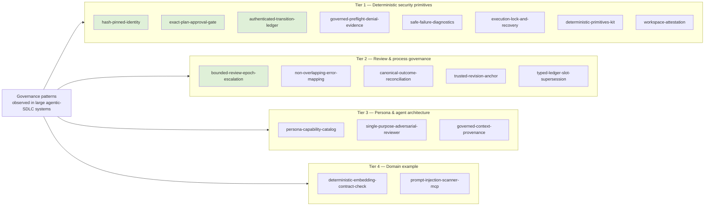

# Decomposition plan: individual agentic-governance demo apps

## Principle

**Bias toward individual features, not orchestration.** Large agentic
governance systems tend to grow a full multi-agent orchestrator (workflow
runner, multi-agent pipeline, integrated UI). Reproducing that here first
would just be a smaller copy of the same hard-to-learn-from system. Instead,
every app in this catalog demonstrates **one** governance primitive,
standalone, with a fake/toy payload instead of a real story, embedding, or
workflow.

Every app states, in the style of an atomic-instruction grading rubric's
criterion record:

- **Atomic claim** — the one sentence a skeptic could test.
- **Inspired by** — the real-world pattern this app models (named for
  context; this repo does not depend on or import from that source).
- **Enforcement class** — deterministic (binary pass/fail), hybrid
  (deterministic envelope + generated content), or informational (pattern
  worth knowing, no gate).

An app whose claim can't fit in one sentence is scoped wrong and should be
split further.

## Explicitly out of scope (for now)

These are real, valuable governance patterns, but they are orchestration,
not primitives — building them here first would recreate the "hard to learn
from" problem this repo exists to solve:

- End-to-end multi-agent workflow orchestration as a whole system.
- An integrated persona → capability → process-lifecycle pipeline.
- A localhost control-panel UI that ties every primitive together.
- A full create → review → remediate loop as one system (its *pieces* —
  bounded review escalation, non-overlapping error mapping — are in scope
  individually; the loop itself is not, yet).

If, after building the individual apps below, composing two or three of them
into a minimal pipeline turns out to be the best teaching tool, that's a
deliberate later decision — not the default.

## App catalog

### Tier 1 — Deterministic security primitives
*Inspired by: hash-pinned executable identity, exact-hash approval gates,
tamper-evident ledgers, and safe failure/recovery handling in governed agent
launchers.*

| App | Atomic claim | Enforcement | Inspired by |
|---|---|---|---|
| `hash-pinned-identity` | A launcher refuses to run any executable whose resolved absolute path *and* SHA-256 don't both match a policy pinned outside the workspace — even if the name on `PATH` is identical. | deterministic | hash-pinned execution identity policies |
| `exact-plan-approval-gate` | A destructive action can only be approved by echoing back the *exact* SHA-256 of the plan that was shown — a "yes" with no hash is rejected. | deterministic | prepare/approve/execute governed-evaluation contracts |
| `authenticated-transition-ledger` | An append-only, SHA-256-chained, HMAC-signed event log detects a single edited byte anywhere in its history, not just at the tampered row. | deterministic | authenticated transition ledgers |
| `governed-preflight-denial-evidence` | When a precondition fails, the system emits a fixed-shape, allowlisted-field denial record — never raw stderr, paths, or secrets. | deterministic | governed preflight denial audits |
| `safe-failure-diagnostics` | A child-process failure is classified into one of a fixed vocabulary of categories from at most 8,192 observed bytes, and only the category — never the bytes — is ever persisted. | deterministic | sanitized failure diagnostic capture |
| `execution-lock-and-recovery` | A crashed run leaves a lock that only an explicit, challenge-authenticated operator attestation can clear — the system never infers liveness on its own. | deterministic | reservation-recovery endpoints |
| `deterministic-primitives-kit` | The same input byte-for-byte always produces the same canonical JSON, the same hash, and the same safe-ID validation — across restarts, across machines. | deterministic | canonical-JSON / safe-ID / atomic-write primitives |
| `workspace-attestation` | A governed run's *claimed* file changes are diffed against a real git-worktree snapshot taken immediately before and after — a claim that doesn't match the diff fails closed. | deterministic | workspace attestation around agent-driven test runs |

### Tier 2 — Review & process governance
*Inspired by: bounded human-escalation loops and deterministic,
non-overlapping validation/reconciliation contracts seen in governed
story-review pipelines.*

| App | Atomic claim | Enforcement | Inspired by |
|---|---|---|---|
| `bounded-review-epoch-escalation` | After 3 review rounds with open findings, the loop stops and requires a *new*, hash-bound human reauthorization naming the exact terminal evidence — it cannot self-extend. | deterministic | hard-capped review-epoch escalation policies |
| `non-overlapping-error-mapping` | Every test fixture reaches exactly one named validation stage and exactly one named error — never two, never zero. | deterministic | non-overlapping validation-stage error mapping |
| `canonical-outcome-reconciliation` | Every input key in a batch receives exactly one attributable success or failure outcome, in a fixed order — nothing silently dropped, nothing double-counted. | deterministic | ordered asset-reconciliation outcome contracts |
| `trusted-revision-anchor` | The "current" commit is selected only from a ledger slot position, never from caller-supplied input; "fresh" means "at the ledger head," not "recent by clock time." | deterministic | trusted revision/freshness contracts |
| `typed-ledger-slot-supersession` | A later record can only replace an earlier one by naming that exact slot key *and* the exact digest of the record it's replacing — a fork or missing predecessor fails closed. | deterministic | typed ledger-slot approval/retention authority |

### Tier 3 — Persona & agent architecture
*Inspired by: declarative persona/capability catalogs and provenance-tagged
context assembly for governed agents.*

| App | Atomic claim | Enforcement | Inspired by |
|---|---|---|---|
| `persona-capability-catalog` | "Who is allowed to do what" (a YAML+JSON-Schema catalog) is fully separate from "what's running right now" (a runtime process list) — you can audit the first without touching the second. | informational | declarative persona/agent catalogs |
| `single-purpose-adversarial-reviewer` | One adversarial-review agent, schema-in/findings-out, callable with zero pipeline, zero orchestrator, and no state carried between calls. | hybrid | single-purpose adversarial-review agents |
| `governed-context-provenance` | Every piece of context handed to a model carries its source and an explicit `injection_disposition` ("clear" vs. untrusted) *before* assembly — the model never has to guess what it can trust. | deterministic | provenance-tagged, request-scoped context assembly |

### Tier 4 — Domain example
*Inspired by: deterministic verification of a vendor API's exact request
contract, and single-purpose MCP servers.*

| App | Atomic claim | Enforcement | Inspired by |
|---|---|---|---|
| `deterministic-embedding-contract-check` | An embedding call's provider, model ID, version, and dimensions can be verified byte-for-byte against a captured request — with no live AWS call. | deterministic | deterministic embedding-request contract verification |
| `prompt-injection-scanner-mcp` | A single-purpose MCP server that does exactly one thing (flag likely prompt injection in a text blob) and nothing else. | hybrid | single-purpose prompt-injection-scanning MCP servers |

18 apps is the target size for v1 — enough to cover every tier without
padding. Anything that doesn't reduce to one atomic claim gets split or cut.

## Build phasing

**Phase 1 (build first — highest teaching value, fewest dependencies):**
`hash-pinned-identity`, `exact-plan-approval-gate`,
`authenticated-transition-ledger`, `bounded-review-epoch-escalation`.
These four alone demonstrate the whole "governed, not just automated"
thesis this repo is built around, without needing anything else in this
repo to exist first.

**Phase 2:** the rest of Tier 1 (`governed-preflight-denial-evidence`,
`safe-failure-diagnostics`, `execution-lock-and-recovery`,
`deterministic-primitives-kit`, `workspace-attestation`).

**Phase 3:** the rest of Tier 2 (`non-overlapping-error-mapping`,
`canonical-outcome-reconciliation`, `trusted-revision-anchor`,
`typed-ledger-slot-supersession`).

**Phase 4:** Tier 3 and Tier 4 in any order — they're independent of each
other and of Tiers 1–2.

## Map

*(Green = Phase 1, build first.)*

## Relationship to future IAB work

Baker Tilly's Instruction Adherence Bench (IAB) proposal measures whether
agent instructions are followed, needed, worth their cost, and produce
better work, against a real "estate" of repositories. This repo is not IAB
and does not build IAB's `corpus/registry/runner/scorer/analysis`
components. But every app here already carries the one thing IAB's registry
would need per instruction — a stable atomic claim traceable to an exact
statement of what it proves — so if a future IAB corpus wants small,
single-concept repositories as task targets, these apps are a natural fit
without rework.

## Next step

Pick a Phase 1 app and scaffold it: minimal source, a fake/toy payload
(never a real story or credential), one focused test proving the atomic
claim, and a short README stating the claim, its inspiration, and how to
run it. Repeat per app — this repo grows one demo at a time, not as one big
initial commit.
